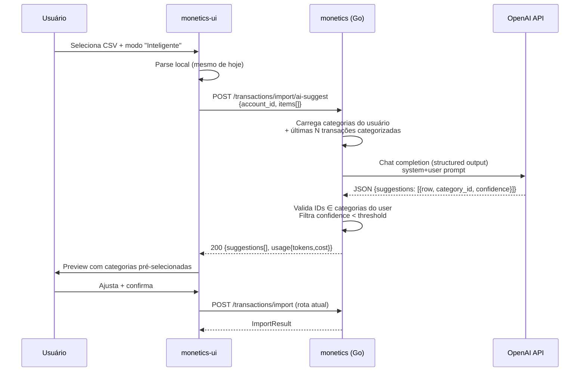

# Spec: Importação Inteligente de Transações com IA (OpenAI)

> Status: Draft  
> Owner: Backend + UI  
> Versão: 1.0  
> Data: 2026-04-26

## 1. Objetivo

Permitir que, ao importar transações via CSV, o usuário escolha um modo **Inteligente** que utiliza a API da OpenAI (LLM) para sugerir automaticamente a `category_id` mais adequada para cada linha, baseando-se nas categorias cadastradas pelo próprio usuário, no histórico recente de transações categorizadas e nos metadados (descrição, valor, tipo, data) de cada item.

O modo **Manual** atual é preservado e continua sendo o padrão para quem prefere classificar linha a linha.

## 2. Motivação / Problema

- Importações reais (extratos Nubank, faturas) frequentemente trazem dezenas a centenas de linhas.
- Atribuir manualmente categoria a cada linha é demorado, propenso a erro e desestimula o uso da feature.
- O usuário já mantém um catálogo de categorias com semântica clara (`Alimentação`, `Transporte`, `Lazer`, etc.) — uma LLM pode mapear descrições livres para essas categorias com alta precisão.

## 3. Escopo

### 3.1 In-Scope
- Novo modo **Inteligente** no diálogo "Importar Transações via CSV" da UI.
- Endpoint backend que recebe as linhas pré-parseadas, chama a OpenAI, devolve sugestões de categoria por linha + grau de confiança.
- Tela de revisão pós-sugestão onde o usuário vê todas as linhas com a categoria sugerida pré-selecionada e pode ajustar antes de confirmar a importação.
- Configuração da chave OpenAI por variável de ambiente (server-side, nunca no browser).
- Cache simples de sugestões por hash da descrição normalizada (para reaproveitamento intra-importação e entre importações recentes).
- Métricas mínimas: tempo de inferência, custo estimado em tokens, taxa de aceitação das sugestões.

### 3.2 Out-of-Scope (futuras iterações)
- Treino fino (fine-tuning) ou embeddings persistentes.
- Sugestão de criação de novas categorias.
- Múltiplos provedores (Anthropic, Gemini, etc.) — arquitetura deve permitir, mas implementação inicial é OpenAI apenas.
- Auto-aprovação sem revisão humana.
- Detecção de duplicidade contra base existente (já existe ou pode ser tratado em spec separada).

## 4. Requisitos

### 4.1 Funcionais

| ID | Requisito |
|----|-----------|
| RF-01 | A UI deve apresentar um seletor de modo de importação: `Manual` (default) e `Inteligente (IA)`. |
| RF-02 | O modo Inteligente só fica disponível se o backend reportar `ai.enabled = true` em `/api/v1/config/features` (ou heurística equivalente). |
| RF-03 | Ao escolher Inteligente, a UI envia ao backend: lista de itens parseados + `account_id` + `user_id` (do JWT). |
| RF-04 | O backend envia ao LLM apenas: descrições, valores, tipo, data e a lista de categorias do usuário (id, nome, type). NÃO envia: dados pessoais, JWT, IDs sensíveis fora do escopo. |
| RF-05 | A resposta do LLM deve ser estruturada: `[{row_index, category_id, confidence, reason?}]`. |
| RF-06 | A UI exibe a tabela de preview com a categoria sugerida pré-selecionada e um indicador visual de confiança (alta/média/baixa). |
| RF-07 | O usuário pode editar qualquer categoria sugerida antes de confirmar. |
| RF-08 | A confirmação final reutiliza o endpoint atual `POST /api/v1/transactions/import` — o LLM **não** persiste nada por conta própria. |
| RF-09 | Se a IA falhar (timeout, erro de API, quota), a UI deve degradar para o modo Manual com mensagem clara e mantendo as linhas já parseadas. |
| RF-10 | Linhas que a IA não consiga classificar com confiança mínima (`< 0.4`) recebem `category_id = 0` e ficam destacadas como "requer revisão". |

### 4.2 Não-Funcionais

| ID | Requisito |
|----|-----------|
| RNF-01 | Latência alvo: ≤ 8s para 100 linhas; ≤ 20s para 500 linhas. |
| RNF-02 | Limite máximo de itens por chamada: 500 (acima disso, paginar em batches no backend). |
| RNF-03 | Chave OpenAI nunca trafega ao browser; somente o servidor a manipula. |
| RNF-04 | Logs do backend NÃO devem registrar a chave nem o conteúdo bruto das respostas além do necessário para auditoria. |
| RNF-05 | Custo controlado: usar `gpt-4o-mini` (ou modelo equivalente custo-eficaz) por padrão. |
| RNF-06 | Feature deve ser desligável por config (`ai.enabled: false`) sem rebuild. |
| RNF-07 | Rate limiting: máximo X requisições/minuto/usuário (default 10). |

### 4.3 Segurança (OWASP)
- A01 (Broken Access Control): valida `user_id` do JWT contra `account_id` e `category_id`.
- A02 (Cryptographic Failures): chave em variável de ambiente, nunca commitada.
- A03 (Injection): descrições do CSV são sanitizadas antes de compor o prompt (escape de delimitadores e remoção de caracteres de controle).
- A05 (Security Misconfiguration): default `ai.enabled = false`.
- A09 (Logging): nunca logar PII das transações em nível `info`; usar `debug` controlado.
- A10 (SSRF): cliente HTTP usado só com URL fixa do endpoint OpenAI; sem URL configurável pelo usuário.

## 5. Design Técnico

### 5.1 Visão Geral



### 5.2 Backend (Go)

#### 5.2.1 Configuração

`config.yaml`:
```yaml
ai:
  enabled: false                # default off
  provider: "openai"            # único suportado v1
  api_key: ""                   # via OPENAI_API_KEY (env override)
  model: "gpt-4o-mini"
  base_url: "https://api.openai.com/v1"
  timeout_seconds: 30
  max_items_per_request: 500
  min_confidence: 0.4
  history_lookback_days: 90
  history_max_examples: 20
  rate_limit_per_minute: 10
```

`internal/config/types.go` — adicionar `AIConfig`:
```go
type AIConfig struct {
    Enabled            bool    `mapstructure:"enabled"`
    Provider           string  `mapstructure:"provider"`
    APIKey             string  `mapstructure:"api_key"`
    Model              string  `mapstructure:"model"`
    BaseURL            string  `mapstructure:"base_url"`
    TimeoutSeconds     int     `mapstructure:"timeout_seconds"`
    MaxItemsPerRequest int     `mapstructure:"max_items_per_request"`
    MinConfidence      float64 `mapstructure:"min_confidence"`
    HistoryLookbackDays int    `mapstructure:"history_lookback_days"`
    HistoryMaxExamples int     `mapstructure:"history_max_examples"`
    RateLimitPerMinute int     `mapstructure:"rate_limit_per_minute"`
}
```

E adicionar campo `AI AIConfig` ao struct `Config`. Validador deve checar: se `Enabled=true`, `APIKey` não pode ser vazia.

Variável de ambiente: `MONETICS_AI_API_KEY` (mapeada via Viper) ou `OPENAI_API_KEY` (fallback).

#### 5.2.2 Estrutura de pacotes

Novo módulo opcional sob `internal/modules/budget`:

```
internal/modules/budget/
├── usecase/
│   └── transaction/
│       ├── import_csv.go              (existente, sem mudanças)
│       └── suggest_categories.go      (NOVO)
└── adapters/
    ├── ai/                             (NOVO)
    │   ├── client.go                   (interface + factory)
    │   ├── openai_client.go            (impl)
    │   └── prompt.go                   (montagem de prompt)
    └── http/handlers/
        └── transaction_handler.go      (adicionar handler SuggestCategories)
```

#### 5.2.3 Interface do cliente IA

```go
// internal/modules/budget/adapters/ai/client.go
package ai

import "context"

type CategorySuggestion struct {
    RowIndex   int     `json:"row_index"`
    CategoryID uint    `json:"category_id"`
    Confidence float64 `json:"confidence"`
    Reason     string  `json:"reason,omitempty"`
}

type Usage struct {
    PromptTokens     int     `json:"prompt_tokens"`
    CompletionTokens int     `json:"completion_tokens"`
    EstimatedCostUSD float64 `json:"estimated_cost_usd"`
}

type SuggestRequest struct {
    Categories []CategoryRef
    History    []HistoryRef       // exemplos few-shot
    Items      []TransactionRef
}

type CategoryRef struct {
    ID   uint
    Name string
    Type string // expense | income | transfer
}

type HistoryRef struct {
    Description string
    CategoryID  uint
}

type TransactionRef struct {
    RowIndex    int
    Description string
    Amount      float64
    Type        string
    Date        string // YYYY-MM-DD
}

type SuggestResponse struct {
    Suggestions []CategorySuggestion
    Usage       Usage
}

type Client interface {
    Suggest(ctx context.Context, req SuggestRequest) (SuggestResponse, error)
}
```

#### 5.2.4 Use case

```go
// internal/modules/budget/usecase/transaction/suggest_categories.go
type SuggestCategoriesInput struct {
    UserID    uint
    AccountID uint
    Items     []ImportItem  // reaproveita struct existente
}

type SuggestCategoriesOutput struct {
    Suggestions []ai.CategorySuggestion
    Usage       ai.Usage
}

type SuggestCategoriesUseCase struct {
    aiClient        ai.Client
    accountRepo     interfaces.AccountRepository
    categoryRepo    interfaces.CategoryRepository
    transactionRepo interfaces.TransactionRepository
    logger          logger.Logger
    cfg             config.AIConfig
}

func (uc *SuggestCategoriesUseCase) Execute(ctx context.Context, in SuggestCategoriesInput) (SuggestCategoriesOutput, error) {
    // 1. valida account pertence ao user
    // 2. busca categorias do user
    // 3. busca histórico (últimas N transações categorizadas, lookback configurável)
    // 4. monta SuggestRequest e chama aiClient.Suggest
    // 5. valida IDs sugeridos ∈ categorias do user; descarta inválidos
    // 6. zera CategoryID quando confidence < cfg.MinConfidence
    // 7. retorna sugestões + usage
}
```

Regras de validação pós-LLM (defesa em profundidade):
- Se LLM retorna `category_id` que não pertence ao user → `category_id = 0`, `confidence = 0`.
- Se número de sugestões ≠ número de itens → preenche faltantes com `category_id = 0`.
- Se `Type` da categoria não bate com `Type` da transação (ex.: categoria `expense` para transação `income`) → tenta achar categoria sibling do tipo correto; se não houver, `category_id = 0`.

#### 5.2.5 Endpoint HTTP

`POST /api/v1/transactions/import/ai-suggest`

Request:
```json
{
  "account_id": 1,
  "items": [
    {"row_index": 0, "date": "2026-03-01", "description": "UBER *TRIP", "amount": 23.50, "type": "expense"},
    {"row_index": 1, "date": "2026-03-02", "description": "IFOOD",      "amount": 47.10, "type": "expense"}
  ]
}
```

Response 200:
```json
{
  "suggestions": [
    {"row_index": 0, "category_id": 12, "confidence": 0.93, "reason": "Uber é serviço de transporte"},
    {"row_index": 1, "category_id": 7,  "confidence": 0.88, "reason": "iFood é alimentação por delivery"}
  ],
  "usage": {"prompt_tokens": 1200, "completion_tokens": 450, "estimated_cost_usd": 0.0011}
}
```

Erros:
- `400` payload inválido / quantidade > `MaxItemsPerRequest`.
- `403` `ai.enabled = false` ou conta não pertence ao user.
- `429` rate limit excedido.
- `502` falha ao chamar OpenAI (timeout, erro upstream).

#### 5.2.6 Endpoint de feature flag

`GET /api/v1/config/features` (extender o existente, ou criar):
```json
{ "ai_import": true }
```

UI consulta esse flag para mostrar/ocultar o modo Inteligente.

### 5.3 Prompt Design

#### System prompt (template fixo, em inglês para reduzir custo de tokens):
```
You are a financial transaction categorizer. Given a list of bank/credit card
transactions and a user's category catalog, assign the most appropriate
category_id to each transaction. Use the provided history examples as
preference signals. Match category type (expense/income/transfer) to
transaction type. If unsure, return category_id=0 and a low confidence value.
Output strictly the JSON schema requested. Do not invent category IDs.
```

#### User prompt (montagem):
```
CATEGORIES:
- id=1  name="Alimentação"   type=expense
- id=2  name="Transporte"    type=expense
- id=7  name="Lazer"         type=expense
...

RECENT EXAMPLES (description -> category_id):
- "UBER TRIP 1234" -> 2
- "IFOOD*PIZZA"    -> 1
...

TRANSACTIONS TO CATEGORIZE:
[
  {"row_index": 0, "description": "UBER *TRIP", "amount": 23.50, "type": "expense", "date": "2026-03-01"},
  ...
]

Return JSON: {"suggestions": [{"row_index":int, "category_id":int, "confidence":float 0..1, "reason":string}]}
```

Usar **Structured Outputs** (`response_format: { type: "json_schema", strict: true }`) para garantir schema válido sem parsing defensivo.

### 5.4 UI (monetics-ui)

#### 5.4.1 Mudanças em `src/views/Transactions.tsx`

1. Adicionar estado:
   ```ts
   const [importMode, setImportMode] = useState<"manual" | "ai">("manual");
   const [aiSuggesting, setAiSuggesting] = useState(false);
   const [aiUsage, setAiUsage] = useState<{prompt_tokens:number; completion_tokens:number; estimated_cost_usd:number} | null>(null);
   ```

2. Ler feature flag:
   ```ts
   const { data: features } = useFeatures(); // novo hook
   const aiAvailable = !!features?.ai_import;
   ```

3. Renderizar `RadioGroup` no diálogo de importação com as duas opções (oculta o radio se `aiAvailable=false`).

4. Após o parse local do CSV, se `importMode === "ai"`:
   - Botão "Sugerir categorias com IA" no preview.
   - Ao clicar: `useSuggestCategoriesAI()` mutation → atualiza `csvPreview` aplicando `category_id` por `row_index`.
   - Mostrar badge de confiança ao lado de cada linha (verde ≥0.8, amarelo 0.4-0.79, vermelho <0.4 ou 0).
   - Mostrar custo estimado e tokens consumidos no rodapé.

5. Botão de confirmação final continua chamando `useImportTransactionsCSV` (mesma rota de hoje).

#### 5.4.2 Novos hooks

`src/hooks/useFeatures.ts`:
```ts
export const useFeatures = () =>
  useQuery({ queryKey: ["features"], queryFn: () => api.get("/config/features").then(r => r.data) });
```

`src/hooks/useSuggestCategoriesAI.ts`:
```ts
export const useSuggestCategoriesAI = () =>
  useMutation({
    mutationFn: (payload: { account_id: number; items: AISuggestItem[] }) =>
      api.post("/transactions/import/ai-suggest", payload).then(r => r.data),
  });
```

#### 5.4.3 UX detalhada

- Linha não classificada (`category_id=0`): destaque vermelho + tooltip "IA não conseguiu classificar — selecione manualmente".
- Botão "Aplicar a todos similares" ao mudar manualmente uma categoria (busca outras linhas com descrição parecida e oferece replicar) — opcional v1.5.
- Loading: skeleton + texto "Analisando 157 transações com IA…".
- Erro: toast "Falha ao chamar IA. Você pode classificar manualmente." e força `importMode = "manual"`.

## 6. Plano de Implementação (fases)

### Fase 1 — Backend base
1. Adicionar `AIConfig` em `internal/config/{types,validator,loader}.go`.
2. Criar pacote `internal/modules/budget/adapters/ai/` com interface, cliente OpenAI e prompt builder.
3. Criar `SuggestCategoriesUseCase`.
4. Adicionar handler + rota `POST /transactions/import/ai-suggest`.
5. Endpoint `GET /config/features`.
6. Wire-up em `module.go`.
7. Testes unitários (mock do `ai.Client`).

### Fase 2 — UI
1. Hook `useFeatures` e `useSuggestCategoriesAI`.
2. Radio de seleção de modo no diálogo.
3. Botão "Sugerir com IA" + estado de loading.
4. Aplicar sugestões ao `csvPreview` com badges de confiança.
5. Tratamento de erro com fallback manual.

### Fase 3 — Hardening
1. Rate limiting middleware por user.
2. Cache em memória (LRU) por hash de descrição normalizada (TTL 24h).
3. Métricas: contador de chamadas, tokens, latência (Prometheus opcional).
4. Documentação OpenAPI + atualização do Postman.

## 7. Estratégia de Testes

| Camada | Cenário |
|--------|---------|
| Unit (use case) | LLM retorna IDs válidos → todas sugeridas |
| Unit (use case) | LLM retorna ID inexistente → vira 0 |
| Unit (use case) | LLM retorna confidence baixa → vira 0 |
| Unit (use case) | LLM retorna menos itens que o input → faltantes viram 0 |
| Unit (use case) | Tipo da categoria não bate → tenta sibling, senão 0 |
| Unit (cliente openai) | Timeout → erro propagado |
| Unit (cliente openai) | 429 OpenAI → erro propagado |
| Integration | Endpoint com `ai.enabled=false` → 403 |
| Integration | Excede `max_items_per_request` → 400 |
| UI (manual) | Importação manual continua funcionando |
| UI (e2e) | Modo IA aplica sugestões e usuário pode editar |
| UI (e2e) | Falha de IA cai para manual |

## 8. Métricas de Sucesso

- ≥ 80% das linhas em testes reais recebem categoria correta sem edição manual.
- ≥ 50% dos usuários que importam CSV usam o modo Inteligente após 1 mês.
- Custo médio por importação ≤ US$ 0,01 para 100 linhas.
- Latência p95 ≤ 12s para 200 linhas.

## 9. Riscos e Mitigações

| Risco | Mitigação |
|-------|-----------|
| LLM alucina category_id | Validação estrita server-side; structured outputs. |
| Custo OpenAI cresce | Modelo `gpt-4o-mini`; cache por descrição; rate limit. |
| Latência alta para CSVs grandes | Batches paralelos no backend; timeout configurável; fallback manual. |
| Vendor lock-in OpenAI | Interface `ai.Client` permite outros providers em v2. |
| Vazamento de PII | Apenas descrição/valor/data são enviados; logs sem corpo bruto. |
| Categoria errada passa despercebida | Sempre exigir confirmação humana antes de persistir. |

## 10. Itens Abertos / Decisões a Tomar

1. Endpoint de feature flag: estender existente ou criar novo `/config/features`?
2. Cache de sugestões: in-memory simples ou Redis (se já houver na infra)?
3. Histórico para few-shot: limitar a top-N por categoria mais frequente, ou aleatório dos últimos 90 dias?
4. Mostrar custo em USD para o usuário ou apenas para o admin?
5. Suporte futuro a "criar nova categoria" sugerido pela IA?

## 11. Referências

- OpenAI Structured Outputs: https://platform.openai.com/docs/guides/structured-outputs
- OpenAI Pricing (gpt-4o-mini): https://openai.com/api/pricing/
- OWASP Top 10 (2021): https://owasp.org/Top10/
- Clean Architecture (Uncle Bob): https://blog.cleancoder.com/uncle-bob/2012/08/13/the-clean-architecture.html
- Echo v4 docs: https://echo.labstack.com/docs
